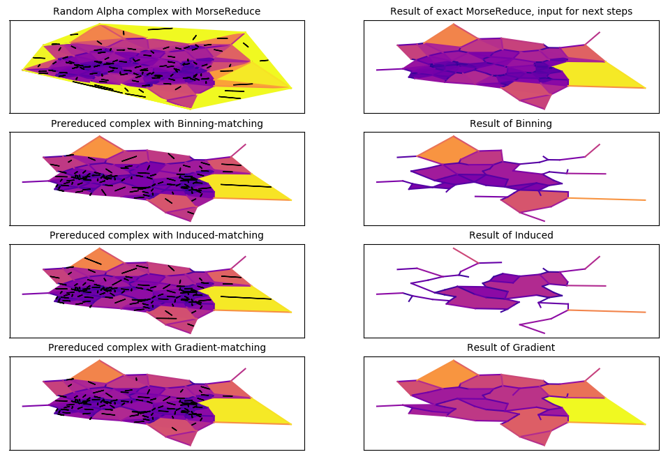

# Fuzzy Eureka

**Approximating Persistent Homology**

(With courtesy to github's repo name generator) 

Code base for a paper by Arkadi Schelling and Alex Wagner.

Extends ideas of Discrete Morse Theory from \[MN13\] *Konstantin Mischaikow and Vidit Nanda -
Morse Theory for Filtrations and Efficient Computation of Persistent Homology, 2013*


## Rerun experiment

To have the same environment there is a [**Docker**](https://www.docker.com/) 
container built by the [Dockerfile](Dockerfile). 
The container also includes the relevant commit of this repo with the 
test data, the experiment and the outputs.
You can download (~4GB) and start the container with
```
docker run --rm -p 8888:8888 -e JUPYTER_ENABLE_LAB=yes -v "$PWD":/home/jovyan/work registry-1-stage.docker.io/arksch/fuzzy-eureka:experiment
```

The `-v` option makes your current working directory accessible from 
within the docker container, which can be useful to process your own data

Open the link that is provided after starting the container gives you 
a [Jupyter lab](https://jupyterlab.readthedocs.io/en/stable/) environment in your browser. 
The runtimes and reduction sizes are provided in the `timings` folder.

From the Jupyter lab open the file `bin/timing_altair_plots.ipynb`. 
This is a jupyter notebook to create some plots
and for interactively playing with the data.
You can also start your own notebook
or an ipython console from the lab's command line

You can rerun the experiment from the Jupyter lab command line
```
rm -r work/timings
cd work/bin
python timing.py --help
```

There are [scripts](plots/) to recreate the plots used for the paper.

## Using the Code

Feel free to use this code for further development and research.
It is distributed under an MIT license.

### As a Docker

Follow the [instructions above](#rerun-experiment) to install the Docker container.
You should be able to [run tests](#further-development)
and [plot things](#plotting) without any further steps.

### As a Library

The code is not packaged in pip.
If you are only planning to import this code, you can install it as a package.

Clone the repo
```
git clone https://github.com/arksch/fuzzy-eureka
cd fuzzy-eureka
```
Consider using a virtual environment
```
pip install virtualenv
virtualenv venv
venv/bin/activate
```
Install the `dmt` package (editable, so you can change the source)
```
pip install -r requirements.txt
pip install -e .
```

The fastest approximative algorithm is *Binning* with Perseus.
Install [Perseus](https://people.maths.ox.ac.uk/nanda/perseus/index.html),
then either put the executable at `./Perseus/perseus`
or set the environment variable `export PERSEUSPATH=/home/abc/Perseus/perseus`
This allows to run
```python 
import numpy as np
from dmt import AlphaComplex
from dmt.perseus import perseus_persistent_homology
dim = 2
samples = 1000
delta = 0.01
cplx = AlphaComplex(np.random.randn(samples, dim))
diagrams = perseus_persistent_homology(cplx, delta=delta)
```

### Plotting

If you are planning to use the plotting abilities of this repo you should also run
```
pip install -r requirements.plot.txt
```

Apart from methods in `dmt.plot` to plot persistence diagrams and
cell complexes based on 2D point clouds this also allows to run the 
scripts from [plot](plots/), e.g.
```
python plot/plot_three_approximations.py
```
to create the following image



### Further Development

Install [Gudhi](https://gudhi.inria.fr/python/latest/installation.html),
which is not packaged in pip (but with conda).
We need Gudhi only for testing, as it computes the correct Bottleneck distances.
By the time of writing [persim's Bottleneck](http://persim.scikit-tda.org/) was
 installable with `pip` but buggy.

Run tests with
```
py.test -v
```

Create HTML code coverage report at `htmlcov/index.html` that can be opened in your browser
```
py.test --cov=.
coverage html
```
